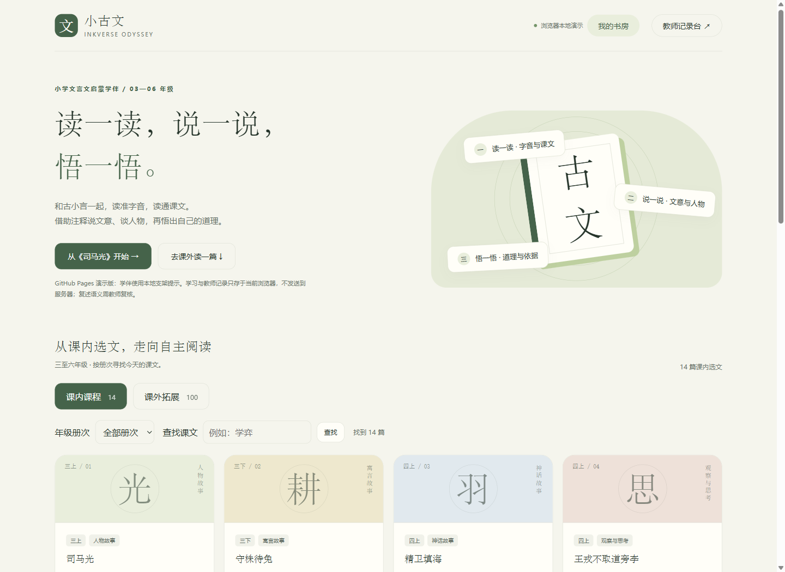
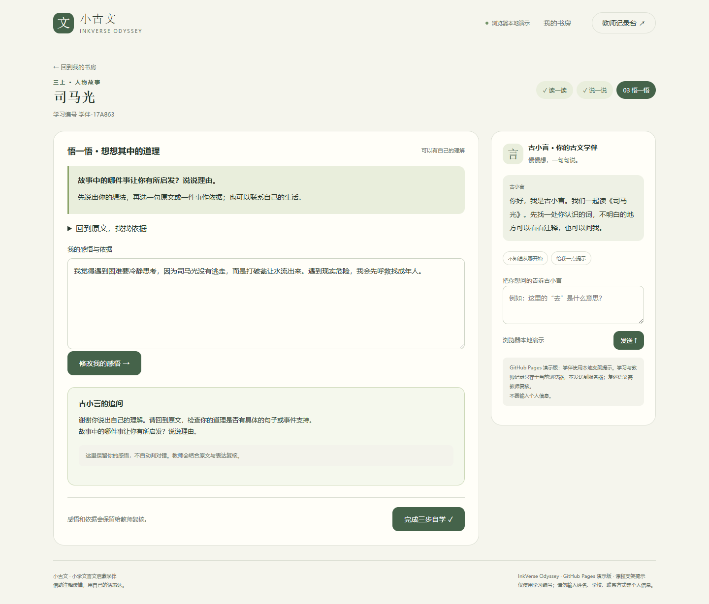
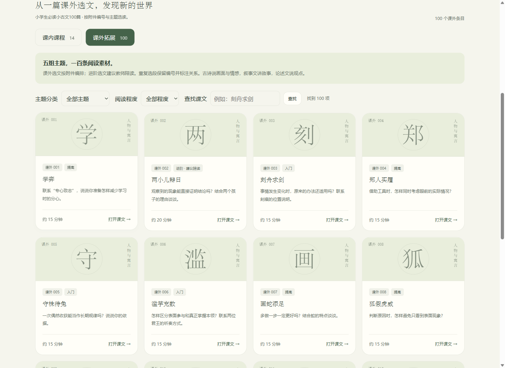
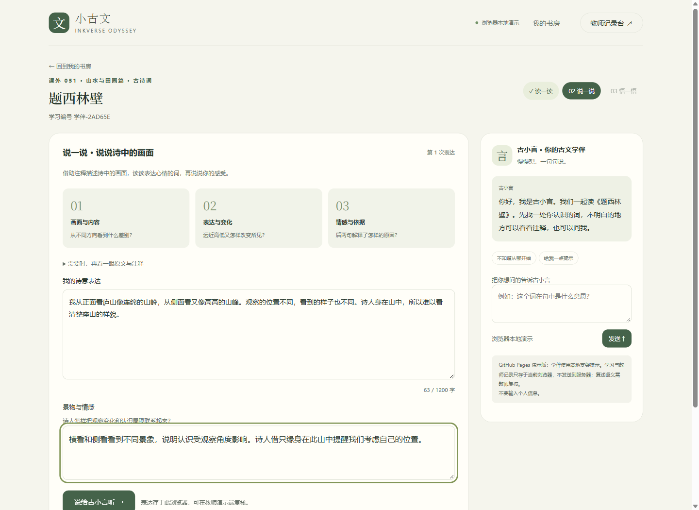

# InkVerse Odyssey · 墨语奇旅

**小学文言文启蒙学伴：读一读，说一说，悟一悟。**

[在线体验](https://wanderer09.github.io/inkverse-odyssey/) · [GitHub 仓库](https://github.com/Wanderer09/inkverse-odyssey)

「古小言」陪伴小学三至六年级学生借助注释自主学习，为教师保留具体表达和学习卡点。学生书房名为「小古文」，英文项目名 InkVerse Odyssey 意为一段探索古文的墨语旅程。



## 三步学习

- **读一读**：核对重点字音，查看原文与停顿提示，完整朗读并自查。再借助注释完成两个词句理解挑战。朗读自查是学生自述，系统不自动判音。
- **说一说**：借助注释用自己的话讲故事，说说人物特点并寻找依据。论述类选文说观点与理由，写景文说景物与感受，古诗词说画面与情感。
- **悟一悟**：想想文章蕴含的道理，选择一句原文或一件事说明依据，也可联系生活。可以修改自己的感悟。

教师口令：**`246810`**。教师记录台可以查看错答、求助、文意表达、人物特点和道理感悟，填写观察、更新跟进状态、筛选和导出 CSV。点击「预览合成演示数据」可查看标注清楚的虚构案例。



## 课内课程

按用户提供的统编教材学习目录组织十四篇选文，支持册次筛选和标题查找。

| 册次 | 选文 |
| --- | --- |
| 三上 | 司马光 |
| 三下 | 守株待兔 |
| 四上 | 精卫填海、王戎不取道旁李 |
| 四下 | 囊萤夜读、铁杵成针 |
| 五上 | 古人谈读书、少年中国说（节选） |
| 五下 | 杨氏之子、自相矛盾 |
| 六上（新版） | 两小儿辩日、曹冲称象 |
| 六下（新版） | 学弈、关尹子教射 |

古籍原文、原创注释、理解题、人物追问和感悟任务均在 `content/lessons.mjs` 中。选段、标点与所用教材可能有差异，课堂教学以手边教材为准。资料核对与来源见 [课程来源说明](docs/课程来源.md)。

## 课外拓展100条

已按用户所附《小学生必读小古文100篇（全）及释义》PDF导入原文，配套原创字词注释、两个理解挑战、三段表达支架、特点或情感追问与感悟任务。现在共有 **14篇课内课程＋100个课外编号条目**。

课外分为启蒙与哲理、人物与风骨、山水与田园、智慧与谋略、情感与咏怀五组，每组20条；支持主题、阅读程度和标题筛选，每页最多12条。附件包含21篇古诗词及部分较长选段，进阶课程标注建议教师陪读。

保留附件的三个重复选段编号组并提示关系；两条引文有依据原典的校订说明。100条对应97种原文选段，具体编号见 [课外课程目录](docs/课外课程目录.md)，整理依据见 [课程来源](docs/课程来源.md)。





## 演示边界

GitHub Pages 版完全在浏览器运行，无需 API 密钥。古小言使用课程规则提供支架，表达与感悟不自动判对错，**需要教师复核**；在线演示未接入真实大模型。

记录保存在当前浏览器，刷新可以恢复已提交的表达。教师只能查看同一浏览器的记录，不收集其他设备或班级数据。清除站点数据会删除记录；存储不可用时显示临时模式。演示口令只展示教师角色流程，不提供真实账号隔离。请使用虚构学习内容。

查看注释是一种学习策略，不自动认定为困难。提交复述、特点或感悟属于待复核过程证据，也不必然说明学生有困难。教师可标为无需跟进。系统不进行能力排名。

## 本地运行与部署

安装 Node.js 22.9 或更高版本，无需安装 npm 依赖。

```sh
npm test
npm run build:demo
npm run preview:demo
```

访问 `http://127.0.0.1:3211/inkverse-odyssey/`。推送 `main` 后，GitHub Actions 自动测试、构建和部署。见 [Pages 部署说明](docs/Pages演示部署.md)。

仓库保留可选服务端：`npm start` 后访问 `http://127.0.0.1:3210`。服务端持久化学习数据，并可配置国产大模型接口。见 [本地运行](docs/本地运行.md) 与 [智能体设计](docs/智能体设计.md)。真实模型需要自己的账号和密钥；已有模型测试使用模拟接口，不代表真实服务实测。

十九项自动测试覆盖十四篇课内课程和全部100条课外课程、三步阶段边界、人物与感悟证据、教师复核与导出、会话隔离、持久化与删除、存储异常、模型适配及静态构建。另用真实浏览器验证分页、筛选、查找、叙事、论述与诗词课程、刷新恢复、CSV 下载及桌面与手机布局。截图均使用自编演示表达。

## 项目结构

| 路径 | 用途 |
| --- | --- |
| `content/lessons.mjs` | 十四篇课内选文与课程合集 |
| `content/extra-lessons.mjs` | 100条课外原文、原创注释和按文体适配的三步任务 |
| `agent/teaching.mjs` | 共用课程规则与表达、感悟提示 |
| `agent/core.mjs` | 古小言角色提示词、模型适配和证据校验 |
| `demo/runtime.mjs` | 浏览器学习状态和教师记录 |
| `public/` | 学生书房、三步学习界面、教师记录台 |
| `server.mjs` | 可选本地服务端 |
| `scripts/build-demo.mjs` | 生成十个静态网页文件 |
| `.github/workflows/pages.yml` | 测试、构建、部署 |
| `tests/` | 学习业务与运行边界验证 |
