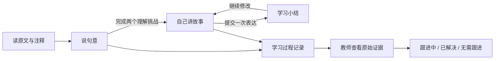

# 智能体设计与接入

小竹是由「确定的学习状态＋课程知识＋可调用工具＋大模型生成＋教师复核」组成的教学智能体。默认本地演示提供确定的支架；配置国产大模型后，对话和开放复述反馈调用模型。两种输出有明确来源标记。

## 角色与目标

完整系统提示词保存在 `agent/core.mjs` 的 `SYSTEM_PROMPT`。角色面向小学三、四年级，采用短句、具体肯定和一问一答的节奏。目标是学生借助注释理解原句，以自己的话有序讲述故事。提示词限制整篇译文代写、学生身份信息索取、侮辱与诊断；神话和现实救援分开说明。

教学反馈次序：肯定一个具体尝试 → 引用一处原文或注释 → 提一个问题。逐级支架为原文位置提示、词义提示、句首或顺序框架。提示词是生成约束，仍需模型实测与教师复核，不能保证所有模型输出都完全符合教学要求。

## 状态与工具

| 工具与接口 | 功能 |
| --- | --- |
| `POST /api/sessions` | 创建随机学习编号与会话令牌 |
| `POST /api/sessions/:id/stage` | 检查阶段前置条件并切换任务 |
| `POST /api/sessions/:id/note` | 记录查看注释的行为 |
| `POST /api/sessions/:id/answer` | 判定封闭理解题，错误时记录具体证据 |
| `POST /api/sessions/:id/hint` | 提供注释支架并记录主动求助 |
| `POST /api/sessions/:id/chat` | 按课程与阶段进行对话，模型故障时降级 |
| `POST /api/sessions/:id/retell` | 保存表达，生成三部分反馈并校验引用证据 |
| `GET /api/teacher/records` | 教师查看会话与记录 |
| `PATCH /api/teacher/records/:id` | 更新复核状态、备注与复核时间 |
| `GET /api/teacher/export` | 导出 CSV；以文本处理可能的公式输入 |
| `DELETE /api/teacher/sessions/:id` | 删除会话及其关联记录 |

封闭题和阶段权限由服务端执行；模型不能替学生跳过任务或修改教师复核结果。在线对话带当前学习阶段、课文和注释及最近十条对话消息，历史全量留在本地会话中。会话在服务端序列化处理，避免一次学习同时发起多个生成请求。

## 复述反馈协议

模型返回 `reply` 与三个 `rubric` 项，对应「故事开始、事情经过、故事结果」。每项包含状态、来自学生文本的原样证据、一个建议追问。状态允许「已提及、可补充、待复核」；系统验证字段长度、三段标签、状态枚举以及证据确实存在于原表达。不合格的响应改用本地模式，并在页面说明。

「证据存在」只证明引用没有捏造，不证明教学判断正确。教师仍需查看原始故事与上下文。本地模式不把词语命中判为正确，仅展示可回查的线索；即使包含所有关键词，也不会自动标「已提及」。无分数、排名、人格或能力诊断。

## 学习困难记录

字段包括学习编号、会话 ID、课文、阶段、类别、原始证据、建议追问、反馈来源、复核状态、教师备注、记录时间、复核时间与合成数据标记。记录类别为词句理解、支架求助、表达求助、故事复述、原文转述。

复述提交本身是一条待复核过程记录，不必然表示学生存在困难。教师可标为无需跟进。查看注释不自动生成困难记录。

## 模型适配

服务端使用 `fetch` 调用配置的完整兼容接口，发送 `model`、`messages`、温度、输出上限与非流式参数。示例适配千问，参数以实际供应商支持情况为准；若其他模型不支持 `enable_thinking`，需在 `callModel` 中调整。参考[千问官方 Chat API](https://www.alibabacloud.com/help/en/model-studio/qwen-api-via-openai-chat-completions)。

要迁移到 Dify 或其他平台，可复用系统提示词和四篇结构化课文，把课程选择与阶段传入工作流，将复述输出设为上述 JSON 协议，再由现有后端记录与复核。当前未创建外部平台账号或应用。

## 数据边界

默认全部数据只写入本地 `data/learning.json`。开启模型授权开关后，将基本脱敏的表达、课文和历史上下文传入配置的模型服务，界面有说明。手机号、邮箱、常见身份证号有基本屏蔽，真实姓名或学校名称等无法自动可靠识别；不要输入个人信息。

教师令牌有八小时有效期，仅存在服务内存，退出或重启后失效。学习令牌存于当前浏览器会话并在服务端校验，学生不能列举其他学习会话。静态文件限定在前端资源清单，`.env` 和数据文件不对浏览器公开。请求有长度限制、速率限制和跨站来源检查。

默认教师口令公开于演示页面，项目是本地单实例展示应用。学生标识对应会话，而非学校学籍；真实学校应用需另建可靠认证和角色授权，并确认数据管理制度。
