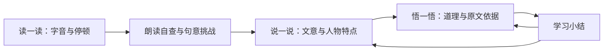

# 古小言：智能体设计与接入

面向小学三至六年级，按「读一读—说一说—悟一悟」提供课程支架和教师复核证据。角色提示词在 `agent/core.mjs`；固定课内课文在 `content/lessons.mjs`，100条课外课文、注释和任务在 `content/extra-lessons.mjs`。模型不能修改学习状态、代替学生跳过任务或修改教师复核结果。

## 教学流程

界面显示三个自学步骤。内部使用 `read`、`understand`、`retell`、`reflect`、`finish` 状态，前两个共同属于读一读。朗读自查属于学生自述，不是录音测评或自动判音。自查后完成两个理解挑战，再提交自己的文意表达与人物特点，随后提交感悟，才可完成学习。

叙事文采用开始、经过、结果支架。论述类《古人谈读书》《少年中国说》采用读书态度、主张、方法、图景、理由等支架，课外课程分叙事、论述、写景和诗词四种表达类型；写景文按观察顺序、景物特点、作者感受展开，诗词按画面与内容、表达与变化、情感与依据展开。「人物特点」在这两篇中分别适配为「求学态度」「少年精神」。

## 支架与生成

古小言一次聚焦一个问题：肯定具体尝试，指向原文或注释，再作追问。逐级帮助包括原文位置、词义提示和表达框架，不直接代写整篇译文或完整表达。神话与现实经验分别说明。网页不索取姓名、学校等身份信息，不提供能力排名。

Pages 版使用 `agent/teaching.mjs` 的课程规则。服务端配置模型和传输授权后，对话与文意表达反馈可调用兼容模型接口；模型不可用或格式不合格时明确降级。人物特点与道理感悟保留原话和课程追问，交教师复核，不自动打分。

## 可调用操作

| 操作 | 功能 |
| --- | --- |
| `GET /api/config` | 课程、模式和课外资料入口 |
| `POST /api/sessions` | 分配学习编号和会话令牌 |
| `POST /api/sessions/:id/reading` | 保存字音与读通课文的学生自查 |
| `POST /api/sessions/:id/stage` | 校验阶段顺序与已完成任务 |
| `POST /api/sessions/:id/note` | 记录主动查看注释，不认定为困难 |
| `POST /api/sessions/:id/answer` | 理解题作答，错答留证据 |
| `POST /api/sessions/:id/hint` | 理解题提示与求助证据 |
| `POST /api/sessions/:id/chat` | 带当前阶段和课程上下文的对话 |
| `POST /api/sessions/:id/retell` | 文意表达与人物特点原话 |
| `POST /api/sessions/:id/reflect` | 感悟与依据，状态为待复核 |
| `GET /api/teacher/records` | 获取学习证据和学习会话 |
| `PATCH /api/teacher/records/:id` | 保存教师观察与复核状态 |
| `GET /api/teacher/export` | 导出带公式输入防护的 CSV |
| `DELETE /api/teacher/sessions/:id` | 删除会话及关联证据 |

Pages 通过浏览器状态引擎处理同样的操作，不发送应用接口请求。

## 表达反馈与证据

模型返回 `reply` 和三个 `rubric` 项，标签按该课文的表达支架填写。每项包含状态、原样表达证据和建议追问。校验字段长度、标签、状态及证据是否确实出现在原表达中；不合格则降级。

证据存在只说明引用没有捏造，不能证明教学判断正确。课程规则仅检查可回查的表达线索，即使包含全部关键词，也不自动认定正确。感悟采用原话留存与追问，不将道理归结为唯一标准答案。

记录类别包括词句理解、支架求助、表达求助、故事复述、文意讲述、人物特点、求学态度、少年精神、道理感悟、诗意表达、景物讲述、观点与态度、景物与情感、描写与感受、阅读感悟和原文转述。提交表达是一条过程证据，不必然代表学习困难，教师可标为无需跟进。

## 数据与版本

Pages 使用按项目路径隔离的本地存储，教师只能查看当前浏览器数据；刷新恢复已提交表达，禁用存储则明确显示临时模式。固定口令只是角色演示入口。

本地服务端将记录写入 `data/learning.json`，校验学生会话令牌、教师令牌和请求来源。教师令牌八小时有效，退出或重启后失效。配置模型并启用授权后，经过基本脱敏的表达和课程上下文将发给配置服务；自动脱敏不能覆盖所有个人信息。

既有四篇课程 ID 保持稳定，旧版会话和教师记录继续可读。未完成的新学习增加朗读自查、特点表达和感悟；已完成旧会话可返回悟一悟补充。

课程册次按用户目录组织；原文选段与教材版次应由教师对照实际教材。课外课程按附件100个编号和五组主题整理，21条为古诗词；同名课内与课外选段使用不同ID，教师记录和CSV显示课外编号。三个重复选段组保留原编号；两条原文校订有原典链接。详见 [课程来源](课程来源.md)。
